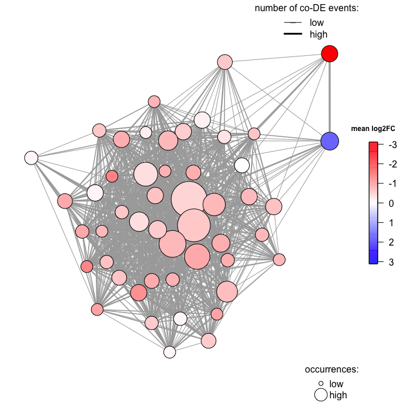
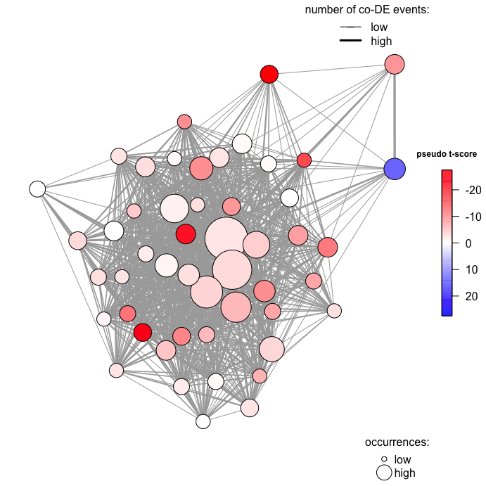

<!-- README.md is generated from README.Rmd. Please edit that file -->
metaDEA
=======

<style>
pre {
  overflow-x: auto;
}
pre code {
  word-wrap: normal;
  white-space: pre;
}
</style>
### Introduction

meta-analysis of differential expression analyses (metaDEA) is a simple package that provide easy functions to integrate the results of previously computed differential expression analyses to find out the genes that are more consistently differentially expressed across different comparisons and their statistics. The power of this package is that it allows to perform meta-analysis on highly heterogeneneous transcriptomic data. Classical co-expression analyses is sensitive to outliers and require high-quality homogenous data, especially in terms of platform. To overcome this limitation we developed a simpler method that uses previously computed differential expression analyses. This allows to apply the suitable method for each specific platform (e.g. moderated t-statistics for microarray and negative binomial for RNA-sequencing data) and thereafter, integrating the results by simply analyzing the already computed log2 fold changes and adjusted p-values.

### Installation

metaDEA can be installed from `github`. You need to have the `devtools` package installed. Also you will need the `igraph` package and the `plot3D` package as depenencies for the plotting function.

``` r

if ("devtools" %in% installed.packages()){
  library(devtools)
} else {
  install.packages("devtools")
  library(devtools)
  }
#> Loading required package: usethis


if ("metaDEA" %in% installed.packages()){
   library(metaDEA)
} else{
    install_github("Ilarius/metaDEA")
    library(metaDEA)
  }
```

### Generating the dataset for the meta-analysis

The `create_dataset` dataset function joins all the results of the differential expression analyses (DEAs) that you want to integrate in a single list.

In the example we load two different dataframes with the differential expression analyses performed on Down syndrome samples. The first (`ipsc_deseq2`) is the results of a DEA performed with `DESeq2` on an mRNA-profiling of induced pluripotent stem cells derived from fibroblasts of monozygotic twins discordant for trisomy 21; the second (`thymus_limma`) is the results of a DEA peformed with `limma` on microarray data of thymic samples from patient with and without Down syndrome.

``` r
options(width=300)
data("ipsc_deseq2")
head(ipsc_deseq2)
#>                 baseMean log2FoldChange     lfcSE      stat       pvalue         padj
#> ENSG00000156508 579814.1      0.2541743 0.1696525 1.4982053 1.340799e-01 2.676178e-01
#> ENSG00000198804 391715.3      0.1866105 0.2205701 0.8460369 3.975322e-01 5.736697e-01
#> ENSG00000198886 335490.6      0.6387031 0.1782505 3.5831771 3.394403e-04 1.866190e-03
#> ENSG00000075624 307336.7      0.4220840 0.1607130 2.6263219 8.631315e-03 3.001498e-02
#> ENSG00000210082 329134.3      0.7549744 0.4359188 1.7319154 8.328863e-02 1.875120e-01
#> ENSG00000198712 273659.4      1.1308065 0.2557758 4.4210850 9.820655e-06 8.038232e-05
```

``` r
data("thymus_limma")
head(thymus_limma[, c(8, 11:15)])
#>              GeneName     logFC   AveExpr         t      P.Value    adj.P.Val
#> 22963 ENSG00000149294 2.3010413  4.720728 11.871408 5.816647e-11 1.264830e-06
#> 1014  ENSG00000160294 0.7549431  9.357336  9.350508 4.573055e-09 4.972054e-05
#> 7011  ENSG00000151623 1.1028556  5.841848  7.546674 1.672937e-07 1.212601e-03
#> 13680 ENSG00000273590 0.7208648  8.262929  6.650076 1.175556e-06 4.260412e-03
#> 13681 ENSG00000205670 0.7208648  8.262929  6.650076 1.175556e-06 4.260412e-03
#> 450   ENSG00000183255 0.6365725 10.731196  6.658153 1.154547e-06 4.260412e-03
```

We then create the dataset by specifying the name(s) of the columns containing respectively the identifiers (`GeneName`), the adjusted p-values (`adj.P.Val` and `padj`) and the log2 fold changes (`logFC` and `log2FoldChange`). Please note that in `ìpsc_deseq2` there is no column for the identifiers (gene names are in the rownames) and therefore you do not need to specify anything in the `col_name` argument. Also notice that the identifiers should be of the same type. Therefore, for the `thymus_limma` dataset ensemble identifiers have been previously retrieved from the probe names with an annotation package.

``` r
list_array_2studies=create_dataset(thymus_limma, ipsc_deseq2,col_names="GeneName", col_adjpvals=c("adj.P.Val", "padj"), col_log2FC=c("logFC", "log2FoldChange"))
```

This returns a list of 3 lists, one called `names` with the gene identifiers of the two comparisons (each one is a sublist named with the names of the DEAs), one called `adjpval` with the adjused p-values of the comparisons and one called `log2FC` with the log2 fold changes. The elements of each sublist are ordered in the same way like that there is a correspondance among names, adjusted p-values, and fold changes for each gene.

``` r
str(list_array_2studies)
#> List of 3
#>  $ names  :List of 2
#>   ..$ thymus_limma: chr [1:20994] "ENSG00000149294" "ENSG00000160294" "ENSG00000151623" "ENSG00000273590" ...
#>   ..$ ipsc_deseq2 : chr [1:58336] "ENSG00000156508" "ENSG00000198804" "ENSG00000198886" "ENSG00000075624" ...
#>  $ adjpval:List of 2
#>   ..$ thymus_limma: num [1:20994] 1.26e-06 4.97e-05 1.21e-03 4.26e-03 4.26e-03 ...
#>   ..$ ipsc_deseq2 : num [1:58336] 0.26762 0.57367 0.00187 0.03001 0.18751 ...
#>  $ log2FC :List of 2
#>   ..$ thymus_limma: num [1:20994] 2.301 0.755 1.103 0.721 0.721 ...
#>   ..$ ipsc_deseq2 : num [1:58336] 0.254 0.187 0.639 0.422 0.755 ...
```

### Subsetting the dataset

Researchers might want to filter the comparisons included in the dataset based on fold changes and/or p-values to focus on the genes significantly changing in one condition compared to another. Here we upload a dataset containing the results of 124 comparisons between trisomic samples versus euploid samples that had been previously filter using a low threshold (adjusted p-value&lt;0.1). These comparisons belong to both mouse and human samples and include different cells, tissues, and platform (both sequencing and microarrays). We use the function `subset_metanalysis` to further filter each comparison keeping only the genes with adjusted p-value &lt; 0.05 and absolute fold change &gt;1.5. Since this filter could still be too low for some of the comparisons we also set a third threshold to keep only the first 500 genes in case there are more than 500 DE genes.

``` r
#load data
data(list_array)
# create a list of lists were only the first 500 most significant genes with adjusted p-value < 0.05 and fold change >1.5 or < -1.5 are included
list_array.05_fc1.5_max500 <- subset_metanalysis(dataset=list_array, adjpval = 0.05, abslog2FC = log2(1.5), max_n_genes = 500 )
```

By applying these thresholds we end up with 92 comparisons.

### Find statistics for individual genes

Once we have our filtered dataset we might be interested in how specific genes are dysregulated across the different comparisons. We coded a simple function to retrieve this information by querying specific genes. The function `find_fold_changes_and_pvalues` returns a dataframe with log2 fold changes and adjusted p-values for each one of the comparisons of the different studies. For this example we query the DYRK1A gene and find its deregulation (mainly upregulation) in 9 comparisons, as expected since this genes is coded on the triplicated chromosome and is one of the most studied for its pathogenetic role in several hallmarks of the syndrome.

``` r
#retrieve log2FCs and adjusted-p-values for the DYRK1A gene (ensemblID="ENSG00000157540")
find_fold_changes_and_pvalues(gene="ENSG00000157540",dataset=list_array.05_fc1.5_max500)
#>                            log2FC      adjpval
#> GSE121066               0.8714199 6.207130e-06
#> GSE48553                0.6868195 9.288870e-05
#> GSE83449                0.5869155 1.289070e-04
#> GSE70102               -0.8750075 1.960972e-03
#> GSE4119.aml             1.5457345 2.757646e-03
#> EMEXP654                0.8078573 3.151341e-03
#> GSE42956ipcs           -1.0384554 3.337780e-03
#> GSE79842lymphoblastoid  0.7878831 4.317548e-03
#> GSE59630v1c.adult      -1.1643237 2.071358e-02
```

### Retrieving global statistics of the dataset

We can also retrieve summary statistics of all the genes in the dataset to detect the genes that are most consistently deregulated across all comparisons. In order to rank genes we can consider in how many comparisons a given gene is found differentially expressed (occurences) or we can analyze the fold changes calculating for each gene their mean, standard deviation and median log2 fold change across the different comparisons. We also computed an original statistics that we called "pseudo t-score" corresponding to the ratio of the mean log2FC over the standard deviation of the log2FCs divided by the square root of the number of comparisons. This statistics will therefore be negative for overall downregulated genes and positive for overall upregulated genes and its absolute value will be higher for those genes with high and consistent changes in several comparisons, and lower for inconsistent and variable fold changes (e.g. upregulated in some datasets and downregulated in others) that are found only in a few comparisons.

In this example we focus on the top 50 genes and save computation time.

``` r
gene_stats=find_gene_statistics(dataset=list_array.05_fc1.5_max500, top=50)
#> calculating statistics...
#> Done!
gene_stats
#>              names occurences median_log2FC  sd_log2FC mean_log2FC pseudotscore
#> 1  ENSG00000142168         24     0.7084920 0.99865152   0.5571943    2.7333694
#> 2  ENSG00000159131         22     0.8113634 0.87401634   0.6594345    3.5388607
#> 3  ENSG00000205758         18     0.7382401 0.86154283   0.8231378    4.0535163
#> 4  ENSG00000183255         17     0.9347959 0.60424346   0.9728724    6.6384761
#> 5  ENSG00000159140         16     0.7698319 1.00286171   0.4424971    1.7649376
#> 6  ENSG00000142188         15     0.7287282 0.69252182   0.8167818    4.5679172
#> 7  ENSG00000262473         14     0.8694851 0.72003635   0.7624338    3.9619749
#> 8  ENSG00000155313         13     0.6474804 1.09923109   0.4567077    1.4980317
#> 9  ENSG00000241837         13     0.6973749 0.27871912   0.8096687   10.4739932
#> 10 ENSG00000105855         12    -0.8086322 0.91166458  -0.4587490   -1.7431335
#> 11 ENSG00000159079         12     0.8092006 0.30057483   0.8977752   10.3467892
#> 12 ENSG00000159256         12     0.6630476 0.69006776   0.6330617    3.1779344
#> 13 ENSG00000105877         11     3.1561790 1.04877667   3.1107093    9.8372285
#> 14 ENSG00000154719         11     0.6900875 0.10757366   0.7282284   22.4521544
#> 15 ENSG00000156256         11     0.6750169 1.48897839   0.2342421    0.5217626
#> 16 ENSG00000157617         11     0.6549632 0.20033406   0.7334771   12.1430595
#> 17 ENSG00000159110         11     0.7152227 0.30374609   0.7947054    8.6774435
#> 18 ENSG00000160310         11     0.8881302 0.71088778   1.1835222    5.5216857
#> 19 ENSG00000183527         11     0.6173609 0.96238305   0.2632710    0.9073011
#> 20 ENSG00000198862         11     0.7026759 0.85905037   0.8981938    3.4677499
#> 21 ENSG00000205581         11     0.6810373 0.69580401   0.6118458    2.9164291
#> 22 ENSG00000124440         10     0.7306540 0.71831829   0.6468253    2.8475417
#> 23 ENSG00000141959         10     0.6605445 0.09007073   0.6945108   24.3834585
#> 24 ENSG00000157538         10     0.6492875 0.07770012   0.6749216   27.4682888
#> 25 ENSG00000159086         10     0.7509676 0.81426152   0.9599578    3.7281059
#> 26 ENSG00000160216         10     0.9171184 0.26362710   0.9365126   11.2337198
#> 27 ENSG00000182362         10     0.7683392 0.29446888   0.8969135    9.6318823
#> 28 ENSG00000205726         10     0.6928277 0.85258116   0.1442297    0.5349571
#> 29 ENSG00000154640          9     0.9061982 0.91172235   0.6561714    2.1591158
#> 30 ENSG00000156261          9     0.7076508 0.71941426   0.6694099    2.7914787
#> 31 ENSG00000156273          9     0.8958740 0.94293205   0.9519524    3.0286987
#> 32 ENSG00000157540          9     0.6868195 0.99346738   0.2454270    0.7411226
#> 33 ENSG00000159200          9     0.6865375 0.29637796   0.8029361    8.1274879
#> 34 ENSG00000160213          9     0.7873294 0.32087727   0.8888448    8.3101377
#> 35 ENSG00000160285          9     0.6930847 0.85051401   0.6438080    2.2708904
#> 36 ENSG00000160299          9     0.6853139 0.17256177   0.7314711   12.7166835
#> 37 ENSG00000184900          9     0.7075502 0.41746555   0.8775453    6.3062351
#> 38 ENSG00000243927          9     0.6773687 1.20878981   0.3854541    0.9566281
#> 39 ENSG00000261371          9     0.7211361 0.81790572   0.2164143    0.7937870
#> 40 ENSG00000142166          8     0.6786516 0.11521801   0.6990293   17.1601066
#> 41 ENSG00000154723          8     0.6577371 0.72364761   0.3187788    1.2459692
#> 42 ENSG00000159055          8     0.7775008 0.22627879   0.8346921   10.4334384
#> 43 ENSG00000160208          8     0.8033186 0.82606042   0.8074757    2.7647930
#> 44 ENSG00000160209          8     1.0829450 0.75909577   1.3430298    5.0041934
#> 45 ENSG00000160221          8     0.8300930 2.61454889   1.3293514    1.4380965
#> 46 ENSG00000160226          8     0.8249392 0.81140789   0.8640740    3.0120122
#> 47 ENSG00000164292          8     0.9099431 1.05673586   1.0186894    2.7265930
#> 48 ENSG00000182240          8     0.8195978 0.75801134   0.8058749    3.0070241
#> 49 ENSG00000263160          8     0.9256392 0.39855920   1.0092218    7.1620738
#> 50 ENSG00000281289          8     0.6657355 1.08985655   0.2140506    0.5555102
```

We found that the gene most consistently differentially expressed was SOD1 (ENSG00000142168) found in 24 comparisons, while the gene with the highest fold change was the dynein axonemal heavy chain 11 (DNAH11, ENSG00000105877) with a log2 fold change of 3.1107093. However, the gene with the highest pseudo-t-score was the VPS26 endosomal protein sorting factor C (ENSG00000157538). Interestingly, all these genes (SOD1, DNAH11, and VPS26C) were coded on the triplicated chromosomes. However, DYRK1A (ENSG00000157540) was only found at position 32.

### Co-differential expression analysis

One of the advantages of our approach is that it allows to detect genes that are consistently differentially (co-DE genes) expressed together. By analysing our Down syndrome transcriptomic dataset we found that co-DE genes tend to: (1) be involved in the same gene or (2) disease ontology or in (3) physical and functional interactions reported in STRINGdb or (4) in the same genomic region. Co-differential expression analysis has not to be confused with co-expression analysis. Co-expression between two genes means that gene levels across sample correlate, while in our case it means that the two genes are both differentially expressed in different comparisons. Coming back to our example with DYRK1A by using the `find_coDE` function we found that this gene was found co-DE with 2798 other genes. The most frequent co-DE interactions occurred with five genes that were found co-DE together with DYRK1A in 4 comparisons: CSF2RB (ENSG00000100368), PFKL (ENSG00000141959), USP16 (ENSG00000156256), PAXBP1 (ENSG00000159086), and BRWD1 (ENSG00000185658). Notably, PFKL, USP16, PAXBP1, and BRWD1 are all HSA21 genes.

``` r
#find co-DE genes for the DYRK1A gene (ensemblID="ENSG00000157540")
code_dyrk1a=find_coDE(gene="ENSG00000157540",dataset=list_array.05_fc1.5_max500)
#> calculating combinations...
#> creating gene co-DE matrix...
dim(code_dyrk1a)
#> [1] 2789    4
```

``` r
head(code_dyrk1a)
#>                gene1           gene2 pair_occurrency                                                   comparisons
#> 391  ENSG00000100368 ENSG00000157540               4                       GSE121066;GSE83449;GSE4119.aml;EMEXP654
#> 1279 ENSG00000141959 ENSG00000157540               4             EMEXP654;GSE83449;GSE70102;GSE79842lymphoblastoid
#> 1529 ENSG00000156256 ENSG00000157540               4          GSE4119.aml;GSE83449;GSE70102;GSE79842lymphoblastoid
#> 1576 ENSG00000157540 ENSG00000159086               4 GSE79842lymphoblastoid;GSE83449;GSE4119.aml;GSE59630v1c.adult
#> 2187 ENSG00000157540 ENSG00000185658               4               GSE70102;GSE59630v1c.adult;GSE4119.aml;GSE48553
#> 49   ENSG00000011198 ENSG00000157540               3                                   GSE121066;EMEXP654;GSE70102
```

### Plotting a network of co-DE genes

Let's move forward and find the network of co-DE interactions among the top 50 genes whose statistics we previously retrieved in this vignette. You can whether pass to the function the whole dataset with the option `top=50` or pass the previously computed dataframes: one with the statistics and one with the co-differential expression results. We already computed the statistics for the most frequent 50 genes. We then pass these genes as input to the `find_coDE` function to create our co-DE dataframe. When `find_coDE` receives a vector of genes instead of a single gene it only retrieves co-DE interactions between the genes given as input. Thereafter, we pass both the dataframe with statistics and the one with co-DE interactions to the `plot_gene_coDE_network`. This plot a graph where each node is a gene whose size is proportional to the number of occurrences, and each edge is a co-DE interaction with thickness proportional to the number of comparisons in which a given interaction was found.

We first plot the graph coloring the nodes with the mean fold change across samples. We set `node.names` to `FALSE` since our indentifiers are ensembl gene ID and therefore useless for the reader.

``` r

set.seed(1) #to obtain always the same plot
#create the co-DE matrix for the most frequent 50 genes
code_matrix=find_coDE(gene = gene_stats$names, dataset=list_array.05_fc1.5_max500)
#> calculating combinations...
#> creating gene co-DE matrix...

#plot the network
set.seed(1)
network=plot_gene_coDE_newtork(code_matrix=code_matrix, gene_stats_matrix=gene_stats,node_color="mean", node.names=FALSE)
#> plotting the network...
```



As you can see only one gene is downregulated, corresponding to intergrin beta 8 which is crucial for neurogenesis and neurovascular homeostasis regulation may affect Down syndrome neuropathology.

The function also return the graph as an object for further analysis. Summary statistics of the graph shows that there are 1099 co-DE interactions between the 50 nodes.

``` r
summary(network)
#> IGRAPH a1fcf78 UNW- 50 1099 -- 
#> + attr: name (v/c), size (v/n), color (v/c), weight (e/n), width (e/n)
```

We can also plot the same network this time coloring the nodes using the pseudo-t-score. Please note the usage of `set.seed(1)` before each usage of the plotting function in order to have the nodes plotted in the same place.

``` r
set.seed(1)
network=plot_gene_coDE_newtork(code_matrix=code_matrix, gene_stats_matrix=gene_stats,node_color="pseudotscore", node.names=FALSE)
#> plotting the network...
```



You can see that some genes that had a relatively modest fold change now have become redder, meaning that their changes where consistent across the comparisons, while other genes have become pinkier, suggesting that their high mean log2 fold changes had been pushed by outliers.

If you wants to know more about the Down syndrome dataset used in this vignette please visit this web application:

<https://ilariodetoma.shinyapps.io/shiny_meta-analysis/>

### Session info

``` r
sessionInfo()
#> R version 4.0.2 (2020-06-22)
#> Platform: x86_64-apple-darwin17.0 (64-bit)
#> Running under: macOS High Sierra 10.13.6
#> 
#> Matrix products: default
#> BLAS:   /Library/Frameworks/R.framework/Versions/4.0/Resources/lib/libRblas.dylib
#> LAPACK: /Library/Frameworks/R.framework/Versions/4.0/Resources/lib/libRlapack.dylib
#> 
#> locale:
#> [1] en_US.UTF-8/en_US.UTF-8/en_US.UTF-8/C/en_US.UTF-8/en_US.UTF-8
#> 
#> attached base packages:
#> [1] stats     graphics  grDevices utils     datasets  methods   base     
#> 
#> other attached packages:
#> [1] metaDEA_0.1.0  devtools_2.3.1 usethis_1.6.1 
#> 
#> loaded via a namespace (and not attached):
#>  [1] compiler_4.0.2    prettyunits_1.1.1 remotes_2.2.0     tools_4.0.2       testthat_2.3.2    digest_0.6.25     pkgbuild_1.1.0    pkgload_1.1.0     evaluate_0.14     memoise_1.1.0     pkgconfig_2.0.3   rlang_0.4.7       igraph_1.2.6      cli_2.0.2         yaml_2.2.1        xfun_0.16        
#> [17] withr_2.4.1       stringr_1.4.0     knitr_1.29        desc_1.2.0        fs_1.5.0          plot3D_1.3        rprojroot_1.3-2   glue_1.4.2        R6_2.4.1          processx_3.4.3    fansi_0.4.1       rmarkdown_2.3     sessioninfo_1.1.1 callr_3.4.3       magrittr_1.5      backports_1.1.9  
#> [33] ps_1.3.4          ellipsis_0.3.1    htmltools_0.5.0   assertthat_0.2.1  misc3d_0.8-4      stringi_1.4.6     crayon_1.3.4
```
